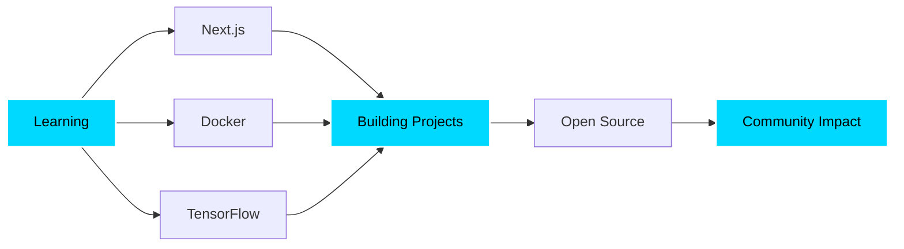

<div align="center">
  
</div>

<div align="center">
  
  [](https://git.io/typing-svg)
  
  <p>
    <a href="https://komarev.com/ghpvc/?username=karanxa1">
      
    </a>
    
    
  </p>
  
</div>

---

## 🎯 About Me

```python
class Karan:
    def __init__(self):
        self.role = "Full Stack Developer & AI Explorer"
        self.location = "🌍 India"
        self.education = "Computer Science Engineering"
        self.interests = [
            "🌐 Web Development",
            "🤖 Machine Learning", 
            "👁️ Computer Vision",
            "🎨 UI/UX Design"
        ]
        self.currently_learning = ["Next.js", "TensorFlow", "Docker"]
        self.motto = "Code, Create, Innovate 🚀"
    
    def say_hi(self):
        print("Thanks for visiting! Let's build something incredible together 💡")

me = Karan()
me.say_hi()
```

<div align="center">
  
### 🌟 Quick Highlights

🔭 Currently working on **AI-powered web applications**  
🌱 Exploring **Deep Learning & Cloud Technologies**  
💬 Ask me about **React, Python, Computer Vision**  
⚡ Fun fact: **I debug with coffee and solve problems with code**  
📫 Reach me: **karanravirajput@gmail.com**

</div>

---

## 🛠️ Tech Arsenal

<details open>
  <summary><b>🎨 Frontend Development</b></summary>
  <br/>
  <p align="center">
    
  </p>
</details>

<details open>
  <summary><b>⚙️ Backend & Database</b></summary>
  <br/>
  <p align="center">
    
  </p>
</details>

<details open>
  <summary><b>🧰 Tools & Platforms</b></summary>
  <br/>
  <p align="center">
    
  </p>
</details>

---

## 🚀 Featured Projects

<div align="center">

| Project | Description | Tech Stack | Live Demo |
|---------|-------------|------------|-----------|
| 👁️ **[Face Detection](https://github.com/karanxa1/face_detection)** | Real-time face detection using Computer Vision | Python, OpenCV | [View →](https://github.com/karanxa1/face_detection) |
| 🌐 **[Portfolio Website](https://github.com/karanxa1/Portfolio-Landing-Page-1)** | Modern & responsive personal portfolio | HTML, CSS, JS | [Visit →](https://karanrajput.me) |
| 🚗 **[Vehicle Detector](https://github.com/karanxa1/vehicledetectorpy)** | AI-powered vehicle detection system | Python, ML | [Explore →](https://github.com/karanxa1/vehicledetectorpy) |
| 🌤️ **[Weather Dashboard](https://github.com/karanxa1/weatherweb)** | Interactive weather forecast app | JavaScript, API | [Try →](https://github.com/karanxa1/weatherweb) |
| 📋 **[Attendance System](https://github.com/karanxa1/newattendance)** | Smart attendance tracking solution | JavaScript | [Check →](https://github.com/karanxa1/newattendance) |

</div>

---

## 📊 GitHub Analytics

<p align="center">
  <a href="https://github.com/karanxa1">
    
  </a>
  <a href="https://github.com/karanxa1">
    
  </a>
</p>

<p align="center">
  <a href="https://git.io/streak-stats">
    
  </a>
</p>

---

## 📈 Contribution Activity

<p align="center">
  
</p>

<p align="center">
  
  
  
</p>

---

## 🏆 GitHub Achievements

<p align="center">
  
</p>

---

## 💼 Experience & Skills

<table align="center">
  <tr>
    <td align="center" width="33%">
      
      <br><b>Development</b>
      <br>Full Stack Web Apps
      <br>Responsive Design
      <br>API Integration
    </td>
    <td align="center" width="33%">
      
      <br><b>AI & ML</b>
      <br>Computer Vision
      <br>Deep Learning
      <br>Model Training
    </td>
    <td align="center" width="33%">
      
      <br><b>Collaboration</b>
      <br>Open Source
      <br>Team Projects
      <br>Code Reviews
    </td>
  </tr>
</table>

---

## 🎨 Coding Activity

<!--START_SECTION:waka-->
```text
JavaScript   █████████████░░░░░░░░   55.2%
Python       ██████████░░░░░░░░░░░   42.8%
HTML/CSS     ████░░░░░░░░░░░░░░░░░   15.6%
Java         ███░░░░░░░░░░░░░░░░░░   12.4%
Other        ██░░░░░░░░░░░░░░░░░░░    8.2%
```
<!--END_SECTION:waka-->

---

## 🌐 Let's Connect

<div align="center">
  <a href="https://github.com/karanxa1">
    
  </a>
  <a href="mailto:karanravirajput@gmail.com">
    
  </a>
  <a href="https://karanrajput.me">
    
  </a>
  <a href="https://linkedin.com/in/karanxa1">
    
  </a>
  <a href="https://twitter.com/karanxa1">
    
  </a>
</div>

---

## 🎯 Current Focus

<div align="center">
  


</div>

---

## 📚 Latest Blog Posts

<!-- BLOG-POST-LIST:START -->
- 🚀 Building Real-Time Applications with WebSockets
- 🤖 Introduction to Computer Vision with OpenCV
- 🎨 Modern CSS Techniques for 2024
- ⚡ Optimizing React Performance
- 🔐 Web Security Best Practices
<!-- BLOG-POST-LIST:END -->

---

## 💡 Random Dev Quote

<div align="center">
  


</div>

---

## 📫 Get In Touch

<div align="center">

**Let's connect and build something amazing together!**

Feel free to reach out for collaborations or just a friendly chat.

</div>

---

<div align="center">
  
  
  <p>
    <b>⭐️ From <a href="https://github.com/karanxa1">karanxa1</a></b>
  </p>
  
  <p>
    <i>💻 "Code is like humor. When you have to explain it, it's bad." - Cory House</i>
  </p>
  
  <p>
    
    
  </p>
</div>
