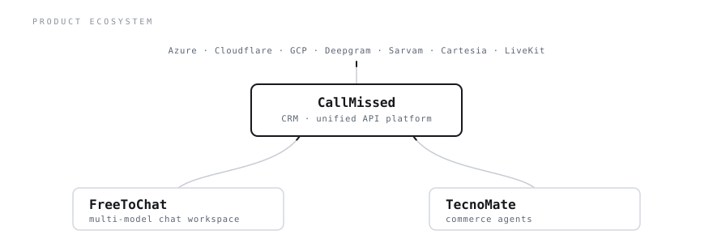

<picture>
  <source media="(prefers-color-scheme: dark)" srcset="assets/signature-dark.svg" />
  <source media="(prefers-color-scheme: light)" srcset="assets/signature-light.svg" />
  
</picture>

# Karan Rajput

Co-founder and forward-deployed engineer in Pune, India. I build customer-facing AI systems end to end — agents, backend, frontend, infra, and rollout — and run them in production.

Currently building [CallMissed](https://callmissed.com), and co-founding [FreeToChat](https://freetochat.app) and [TecnoMate](https://tecnomate.in). Not looking for a job; open to partnerships, design-partner intros, and product collaborations.

<picture>
  <source media="(prefers-color-scheme: dark)" srcset="assets/channels-dark.svg" />
  <source media="(prefers-color-scheme: light)" srcset="assets/channels-light.svg" />
  
</picture>

<h2>&nbsp; What I'm building</h2>

**CallMissed** — an AI-native CRM and customer support platform. It handles engagement across WhatsApp, Instagram, Facebook, voice, email, and web chat in 22 Indian languages, with a unified API layer that other products build on. Infra runs on Azure, Cloudflare, and GCP; LLMs come from Azure OpenAI with multi-model routing; voice runs through Deepgram, Sarvam, Cartesia, and LiveKit. Live at [callmissed.com](https://callmissed.com) ([console](https://console.callmissed.com), [docs](https://docs.callmissed.com)).

**FreeToChat** — a multi-model chat workspace that runs on the CallMissed APIs, with streaming responses and model routing handled by the platform. Live at [freetochat.app](https://freetochat.app).

**TecnoMate** — an electronics marketplace where the AI agents run on the CallMissed APIs: a RAG product catalog, Razorpay payments, and agent orchestration over 65+ endpoints. Live at [tecnomate.in](https://tecnomate.in).

<picture>
  <source media="(prefers-color-scheme: dark)" srcset="assets/ecosystem-dark.svg" />
  <source media="(prefers-color-scheme: light)" srcset="assets/ecosystem-light.svg" />
  
</picture>

<h2>&nbsp; Selected proof</h2>

- Meta Tech Provider and Meta Business Partner — WhatsApp Business Platform, embedded signup, and client onboarding.
- Accepted into Microsoft for Startups, Cloudflare for Startups, and AWS Activate; Deepgram for Startups partner.
- CallMissed backend is FastAPI on Azure Central India, PostgreSQL with pgvector, and seven Next.js apps on Cloudflare Workers.
- FreeToChat and TecnoMate both run in production on the CallMissed API surface.

<h2>&nbsp; How I work</h2>

- Take the hard customer problem and own the whole path from design to production.
- Full-stack by necessity: agents, backend, frontend, cloud, and CI/CD.
- India-first: 22 Indic languages and DPDP-aware infrastructure.

<h2>&nbsp; Selected work</h2>

- [hackathon-cc](https://github.com/karanxa1/hackathon-cc) — Nexus, a local-first RAG system for handwritten PDF notes (TypeScript, FastAPI, ChromaDB).
- [SignSpeak](https://github.com/karanxa1/SignSpeak) — realtime ASL-to-English translation over WebSockets (React, FastAPI, MediaPipe, TFLite).
- [friday-agent](https://github.com/karanxa1/friday-agent) — a self-modifying autonomous agent built on Google ADK and MCP (Python).

<h2>&nbsp; Contact</h2>

- Portfolio: [karanrajput.me](https://karanrajput.me)
- LinkedIn: [karanrrajput](https://www.linkedin.com/in/karanrrajput/)
- Partnerships: [karan@callmissed.com](mailto:karan@callmissed.com)

<h2>&nbsp; Activity</h2>

<picture>
  <source media="(prefers-color-scheme: dark)" srcset="https://raw.githubusercontent.com/karanxa1/karanxa1/output/snake-dark.svg" />
  <source media="(prefers-color-scheme: light)" srcset="https://raw.githubusercontent.com/karanxa1/karanxa1/output/snake-light.svg" />
  
</picture>
