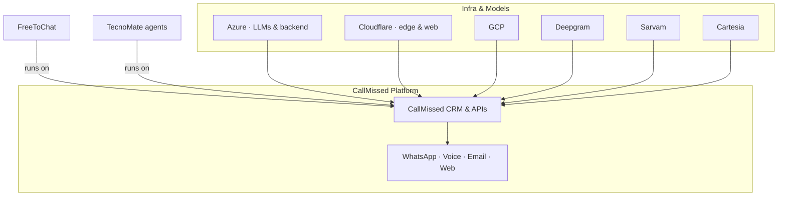

<div align="center">


</div>

<table>
<tr>
<td width="28%" align="center" valign="top">


<br/><br/>

<a href="https://karanrajput.me"></a>
<br/><br/>
<a href="mailto:karan@callmissed.com"></a>
<br/><br/>
<a href="https://www.linkedin.com/in/karanrrajput/"></a>

</td>
<td width="72%" valign="top">

### 👋 Co-founder · Builder · Operator

> Hard customer problems → **agents · backend · frontend · infra · rollout** — end to end in production.

<br/>

| | |
|:---|:---|
| 📍 **Base** | Pune, India · UTC+05:30 |
| 🏢 **Companies** | CallMissed · FreeToChat · TecnoMate |
| ⚡ **Role** | Forward Deployed Engineer & Co-founder |
| ☁️ **Infra** | Azure · Cloudflare · GCP · AWS |
| 🧠 **LLMs** | Azure OpenAI · multi-model routing on CallMissed |
| 🎙️ **Voice** | Deepgram · Sarvam · Cartesia · LiveKit |
| 🔗 **Platform** | CallMissed APIs power FreeToChat & TecnoMate |
| 🛠️ **Stack** | Next.js 16 · React 19 · FastAPI · Postgres |

<br/>

<a href="https://callmissed.com"></a>
<a href="https://freetochat.app"></a>
<a href="https://tecnomate.in"></a>

</td>
</tr>
</table>

<div align="center">


</div>


<div align="center">


</div>

<table>
<tr>
<th>Program</th>
<th>Status</th>
<th>Powers</th>
</tr>
<tr>
<td><b>Microsoft for Startups</b></td>
<td>Accepted</td>
<td>Azure Central India · FastAPI · PostgreSQL/pgvector · CallMissed backend</td>
</tr>
<tr>
<td><b>AWS Activate</b></td>
<td>Portfolio Tier</td>
<td>Supplementary cloud credits · SES · production workloads where needed</td>
</tr>
<tr>
<td><b>Cloudflare for Startups</b></td>
<td>Accepted</td>
<td>7 Next.js apps on Workers · edge delivery · CallMissed web tier</td>
</tr>
<tr>
<td><b>Deepgram for Startups</b></td>
<td>Official Partner</td>
<td>One of several voice providers on CallMissed — STT/TTS alongside Sarvam & Cartesia</td>
</tr>
<tr>
<td><b>Meta Business Partner</b></td>
<td>Partner</td>
<td>Business verification · platform trust · CallMissed go-to-market</td>
</tr>
<tr>
<td><b>Meta Tech Provider</b></td>
<td>Tech Provider</td>
<td>WhatsApp Business Platform · embedded signup · client onboarding · WABA messaging & management for CallMissed</td>
</tr>
</table>


<table>
<tr>
<td align="center" width="33%" valign="top">

### 📞 CallMissed
**`flagship · API platform`**

Core CRM & unified API layer — infra on **Azure + Cloudflare + GCP**, LLMs from **Azure**, voice via **Deepgram · Sarvam · Cartesia · LiveKit**. WhatsApp, Voice, Email & Web Chat across **22 Indian languages**.

<br/>

`Next.js 16` `FastAPI` `Azure` `Cloudflare` `Meta Tech Provider`

<br/>

<a href="https://callmissed.com"></a>

</td>
<td align="center" width="33%" valign="top">

### 💬 FreeToChat
**`co-founded · live`**

Multi-model workspace that **runs on CallMissed APIs** — streaming, models, and agent infra routed through the CallMissed platform.

<br/>

`CallMissed APIs` `React` `Real-time streaming`

<br/>

<a href="https://freetochat.app"></a>

</td>
<td align="center" width="33%" valign="top">

### 🛒 TecnoMate
**`co-founded · live`**

Electronics marketplace where **AI agents run on CallMissed APIs** — RAG catalog, Razorpay, 65+ endpoints, agent orchestration via the platform.

<br/>

`CallMissed APIs` `React 19` `FastAPI` `Razorpay` `RAG`

<br/>

<a href="https://tecnomate.in"></a>

</td>
</tr>
</table>

<details open>
<summary><b>🗺️ product ecosystem</b></summary>


```mermaid
flowchart TB
    subgraph platform [CallMissed Platform]
        CM[CallMissed CRM & APIs]
        CM --> CH[WhatsApp · Voice · Email · Web]
    end

    subgraph infra [Infra & Models]
        AZ[Azure · LLMs & backend]
        CF[Cloudflare · edge & web]
        GCP[GCP]
        DG[Deepgram]
        SV[Sarvam]
        CT[Cartesia]
    end

    FC[FreeToChat] -->|runs on| CM
    TM[TecnoMate agents] -->|runs on| CM
    AZ --> CM
    CF --> CM
    GCP --> CM
    DG --> CM
    SV --> CM
    CT --> CM
```

</details>


<table>
<tr>
<th align="left" width="25%">Layer</th>
<th align="left" width="75%">Providers</th>
</tr>
<tr>
<td><b>Infrastructure</b></td>
<td>Azure · Cloudflare · GCP · AWS</td>
</tr>
<tr>
<td><b>LLMs</b></td>
<td>Azure OpenAI & multi-model routing through CallMissed</td>
</tr>
<tr>
<td><b>Voice</b></td>
<td>Deepgram · Sarvam · Cartesia · LiveKit — all wired into CallMissed, not a single vendor lock-in</td>
</tr>
<tr>
<td><b>Products on APIs</b></td>
<td><b>FreeToChat</b> — full workspace over CallMissed APIs · <b>TecnoMate</b> — commerce agents over CallMissed APIs</td>
</tr>
</table>


<table>
<tr>
<td valign="top" width="58%">

> **CallMissed is the platform.** Infra on Azure + Cloudflare + GCP, LLMs from Azure, voice from Deepgram · Sarvam · Cartesia · LiveKit. FreeToChat and TecnoMate both run on CallMissed APIs.

**Links**
<br/>
🌐 [callmissed.com](https://callmissed.com) · [app](https://app.callmissed.com)
<br/>
📚 [docs](https://docs.callmissed.com) · [platform](https://platform.callmissed.com)

</td>
<td valign="top" width="42%">

```yaml
web:       Next.js 16 · React 19 · Cloudflare Workers
backend:   FastAPI · Azure Central India
db:        PostgreSQL · pgvector
llms:      Azure OpenAI · multi-model API surface
voice:     Deepgram · Sarvam · Cartesia · LiveKit
channels:  WhatsApp · Email · Web Chat · Voice
meta:      Tech Provider · Business Partner
consumers: FreeToChat · TecnoMate (via APIs)
ci_cd:     GitHub Actions
```

</td>
</tr>
</table>

<details>
<summary><b>💬 FreeToChat · deploy spec</b></summary>

<br/>

```yaml
product:   Multi-model chat workspace
platform:  Runs on CallMissed APIs
frontend:  React · streaming UX
models:    Routed through CallMissed (Azure LLMs + platform layer)
live:      https://freetochat.app
```

</details>

<details>
<summary><b>🛒 TecnoMate · deploy spec</b></summary>

<br/>

```yaml
product:   AI-powered electronics marketplace
platform:  AI agents powered by CallMissed APIs
frontend:  React 19 · SEO architecture
backend:   FastAPI · 65+ endpoints · RAG catalog
payments:  Razorpay
live:      https://tecnomate.in
```

</details>


```diff
+ Co-founder mindset     → own product, infra, and customer rollout
+ Forward deployed       → problem → design → production
+ Full-stack operator    → agents + backend + frontend + cloud + CI/CD
+ Small team leverage    → one engineer shipping what used to take three
+ India-first            → 22 Indic languages · DPDP-aware infra
```


<div align="center">

**languages**
<br/>


<br/><br/>

**frontend**
<br/>


<br/><br/>

**infra & cloud**
<br/>


<br/><br/>

**voice providers** *(on CallMissed platform)*
<br/>


<br/><br/>

**backend**
<br/>


</div>


<table>
<tr>
<td width="50%" valign="top">

| Project | Stack |
|:---|:---|
| 🌸 [**Aromic Tales**](https://aromictales.com) | `React 19` `FastAPI` `GSAP` |
| 🌐 [**Portfolio**](https://karanrajput.me) | `React` `Netlify` |
| 👁️ [**face_detection**](https://github.com/karanxa1/face_detection) | `Python` `OpenCV` `dlib` |

</td>
</tr>
</table>


<div align="center">


</div>


<table>
<tr>
<td width="33%" align="center" valign="top">

### 🧠 [hackathon-cc](https://github.com/karanxa1/hackathon-cc)
**Nexus** · local-first RAG for handwritten PDF notes
<br/>`TypeScript` `FastAPI` `ChromaDB` `RAG`
<br/><br/>

<br/>
<a href="https://github.com/karanxa1/hackathon-cc"></a>

</td>
<td width="33%" align="center" valign="top">

### 🤟 [SignSpeak](https://github.com/karanxa1/SignSpeak)
Realtime **ASL → English** · MediaPipe · TFLite · WebSockets
<br/>`React 19` `FastAPI` `OpenCV` `WebSockets`
<br/><br/>

<br/>
<a href="https://github.com/karanxa1/SignSpeak"></a>

</td>
<td width="33%" align="center" valign="top">

### 🤖 [friday-agent](https://github.com/karanxa1/friday-agent)
Self-modifying autonomous agent · **Google ADK** · Claude · MCP
<br/>`Python` `MCP` `Streaming UI`
<br/><br/>

<br/>
<a href="https://github.com/karanxa1/friday-agent"></a>

</td>
</tr>
<tr>
<td width="33%" align="center" valign="top">

### 🏪 [trade-mart](https://github.com/karanxa1/trade-mart)
Govt-approved marketplace · Flask · Streamlit admin
<br/>`Flask` `SQLite` `Render`
<br/><br/>

<br/>
<a href="https://github.com/karanxa1/trade-mart"></a>

</td>
<td width="33%" align="center" valign="top">

### 🚗 [vehicledetectorpy](https://github.com/karanxa1/vehicledetectorpy)
Realtime vehicle detection on video feeds
<br/>`Python` `OpenCV` `YOLO` `TensorFlow`
<br/><br/>

<br/>
<a href="https://github.com/karanxa1/vehicledetectorpy"></a>

</td>
<td width="33%" align="center" valign="top">

### ⚡ [ev-main](https://github.com/karanxa1/ev-main)
EV charging network · maps · booking · AI assistant
<br/>`JavaScript` `Next.js` `Firebase`
<br/><br/>

<br/>
<a href="https://github.com/karanxa1/ev-main"></a>

</td>
</tr>
</table>


<div align="center">

**Not looking for a job** — open to partnerships, design-partner intros, and product collabs.

<br/><br/>

<a href="mailto:karan@callmissed.com"></a>

<br/><br/>

> *"Take the hard problem, ship the whole solution, learn in production."*
>
> — Karan Rajput

<br/>


<br/><br/>


</div>
