<div align="center">
  
</div>

<div align="center">
  
  [](https://git.io/typing-svg)
  
</div>

<br>

<p align="center">
  <a href="https://komarev.com/ghpvc/?username=karanxa1">
    
  </a>
  
  
</p>

<br>


## 🚀 About Me


```python
class Karan:
    def __init__(self):
        self.name = "Karan Rajput"
        self.role = "Full Stack Developer & AI Explorer"
        self.location = "🌍 India"
        self.education = "Computer Science Engineering"
        self.interests = [
            "🌐 Web Development",
            "🤖 Machine Learning", 
            "👁️ Computer Vision",
            "🎨 UI/UX Design",
            "☁️ Cloud Computing"
        ]
        self.currently_learning = ["Next.js", "TensorFlow", "Docker"]
        self.languages = ["Python", "JavaScript", "Java", "C++"]
        self.hobbies = ["Coding", "Reading Tech Blogs", "Gaming"]
        self.motto = "Code, Create, Innovate 🚀"
    
    def say_hi(self):
        print("Thanks for visiting! Let's build something incredible together 💡")
    
    def get_daily_routine(self):
        return {
            "morning": "☕ Coffee + Code",
            "afternoon": "💻 Build Projects",
            "evening": "📚 Learn New Tech",
            "night": "🌙 Debug & Deploy"
        }

me = Karan()
me.say_hi()
```

<br clear="right"/>

### 🌟 Quick Highlights

<table align="center">
  <tr>
    <td align="center">🔭</td>
    <td>Currently working on <b>AI-powered web applications</b></td>
  </tr>
  <tr>
    <td align="center">🌱</td>
    <td>Exploring <b>Deep Learning & Cloud Technologies</b></td>
  </tr>
  <tr>
    <td align="center">💬</td>
    <td>Ask me about <b>React, Python, Computer Vision</b></td>
  </tr>
  <tr>
    <td align="center">⚡</td>
    <td><b>Fun fact:</b> I debug with coffee and solve problems with code ☕</td>
  </tr>
  <tr>
    <td align="center">📫</td>
    <td>Reach me: <a href="mailto:karanravirajput@gmail.com">karanravirajput@gmail.com</a></td>
  </tr>
</table>


## 🛠️ Tech Stack & Tools

<div align="center">

### 💻 Languages


### 🎨 Frontend Development


### ⚙️ Backend Development


### 🗄️ Database & Cloud


### 🤖 AI/ML & Data Science


### 🧰 Tools & Platforms


</div>


## 🚀 Featured Projects

<div align="center">

<table>
<tr>
<td width="50%">

### 👁️ Face Detection System
[](https://github.com/karanxa1/face_detection)

Real-time face detection using Computer Vision and OpenCV. Implements advanced ML algorithms for accurate face recognition.

**Tech:** `Python` `OpenCV` `Machine Learning`

</td>
<td width="50%">

### 🌐 Portfolio Website
[](https://karanrajput.me)

Modern, responsive personal portfolio showcasing projects and skills with smooth animations and interactive UI.

**Tech:** `HTML5` `CSS3` `JavaScript`

</td>
</tr>

<tr>
<td width="50%">

### 🚗 Vehicle Detector
[](https://github.com/karanxa1/vehicledetectorpy)

AI-powered vehicle detection system using deep learning for traffic monitoring and analysis.

**Tech:** `Python` `TensorFlow` `Computer Vision`

</td>
<td width="50%">

### 🌤️ Weather Dashboard
[](https://github.com/karanxa1/weatherweb)

Interactive weather forecast application with real-time data from weather APIs and beautiful UI.

**Tech:** `JavaScript` `Weather API` `CSS3`

</td>
</tr>

<tr>
<td width="50%">

### 📋 Attendance System
[](https://github.com/karanxa1/newattendance)

Smart attendance tracking solution with automated reports and intuitive dashboard interface.

**Tech:** `JavaScript` `Local Storage` `Bootstrap`

</td>
<td width="50%">

### 🔥 More Projects
[](https://github.com/karanxa1?tab=repositories)

Explore more exciting projects on my GitHub profile!

**Topics:** `Web Dev` `AI/ML` `Open Source`

</td>
</tr>
</table>

</div>


## 📊 GitHub Statistics

<div align="center">
  
  
</div>

<div align="center">
  
  
</div>


## 📈 Contribution Activity

<p align="center">
  
</p>

<div align="center">
  
  
  
</div>


## 📅 2025 Contribution Calendar

<p align="center">
  
</p>

<p align="center">
  
</p>

<p align="center">
  <i>💡 GitHub contribution graphs automatically include both public and private repository contributions!</i>
</p>


## 🏆 GitHub Achievements

<p align="center">
  
</p>


## 💼 Skills Showcase

<div align="center">

<table>
  <tr>
    <td align="center" width="25%">
      
      <br><b>React</b>
      <br>⭐⭐⭐⭐⭐
    </td>
    <td align="center" width="25%">
      
      <br><b>Python</b>
      <br>⭐⭐⭐⭐⭐
    </td>
    <td align="center" width="25%">
      
      <br><b>JavaScript</b>
      <br>⭐⭐⭐⭐⭐
    </td>
    <td align="center" width="25%">
      
      <br><b>GitHub</b>
      <br>⭐⭐⭐⭐⭐
    </td>
  </tr>
  <tr>
    <td align="center" width="25%">
      
      <br><b>Docker</b>
      <br>⭐⭐⭐⭐
    </td>
    <td align="center" width="25%">
      
      <br><b>MySQL</b>
      <br>⭐⭐⭐⭐
    </td>
    <td align="center" width="25%">
      
      <br><b>C++</b>
      <br>⭐⭐⭐⭐
    </td>
    <td align="center" width="25%">
      
      <br><b>REST API</b>
      <br>⭐⭐⭐⭐⭐
    </td>
  </tr>
</table>

</div>


## 🎯 Current Focus & Learning Path

```mermaid
graph LR
    A[🎯 2025 Goals] --> B[Next.js Mastery]
    A --> C[TensorFlow Deep Dive]
    A --> D[Docker & DevOps]
    B --> E[Full Stack Projects]
    C --> E
    D --> E
    E --> F[🚀 Production Apps]
    F --> G[🌟 Open Source Contributions]
    
    style A fill:#00d9ff,stroke:#fff,stroke-width:2px,color:#000
    style E fill:#00d9ff,stroke:#fff,stroke-width:2px,color:#000
    style G fill:#00d9ff,stroke:#fff,stroke-width:2px,color:#000
```

<div align="center">



</div>

<table align="center">
  <tr>
    <td align="center">
      
      <br><b>Next.js</b>
      <br>
    </td>
    <td align="center">
      
      <br><b>TensorFlow</b>
      <br>
    </td>
    <td align="center">
      
      <br><b>Docker</b>
      <br>
    </td>
    <td align="center">
      
      <br><b>Kubernetes</b>
      <br>
    </td>
  </tr>
</table>


## 📚 Latest Blog Posts & Articles

<div align="center">

| 📝 Title | 📅 Date | 🔗 Link |
|----------|---------|---------|
| 🚀 Building Real-Time Apps with WebSockets | Coming Soon | [Read →](#) |
| 🤖 Computer Vision with OpenCV - A Beginner's Guide | Coming Soon | [Read →](#) |
| 🎨 Modern CSS Techniques for 2025 | Coming Soon | [Read →](#) |
| ⚡ React Performance Optimization Tips | Coming Soon | [Read →](#) |
| 🔐 Web Security Best Practices | Coming Soon | [Read →](#) |

</div>


## 💡 Dev Quote of the Day

<div align="center">
  


</div>


## 🌐 Connect With Me

<div align="center">
  
[](https://github.com/karanxa1)
[](mailto:karanravirajput@gmail.com)
[](https://karanrajput.me)
[](https://www.linkedin.com/in/karanrrajput/)

</div>

<div align="center">
  <br>
  
  
  
  <br><br>
</div>


## 📫 Get In Touch

<div align="center">

**💬 Let's connect and build something amazing together!**

Feel free to reach out for collaborations, tech discussions, or just a friendly chat about code! ☕

<br>

```javascript
const contactKaran = {
  email: "karanravirajput@gmail.com",
  portfolio: "https://karanrajput.me",
  linkedin: "karanrrajput",
  availability: "Open for opportunities",
  response_time: "Within 24 hours ⚡"
}

// Let's collaborate! 🚀
```

</div>


<div align="center">
  
  
  <br>
  
  <p>
    
    
    
  </p>
  
  <p>
    <b>⭐️ From <a href="https://github.com/karanxa1">karanxa1</a> | Thanks for visiting! 🚀</b>
  </p>
  
  <p>
    <i>"First, solve the problem. Then, write the code." - John Johnson</i>
  </p>
  
  <br>
  
  
</div>
